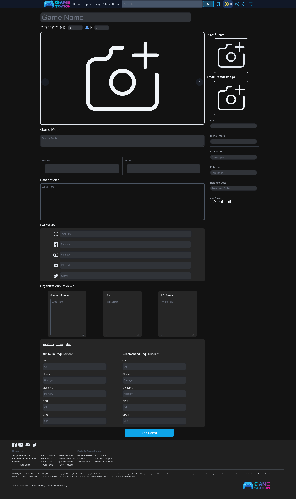
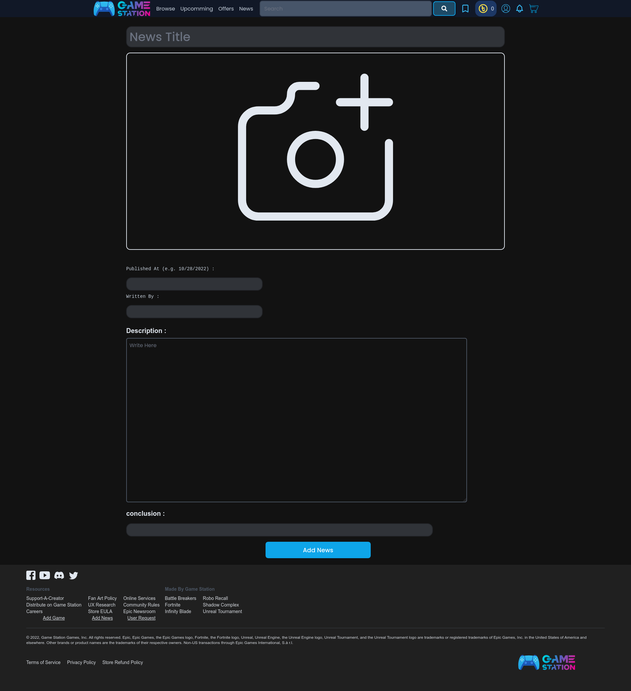
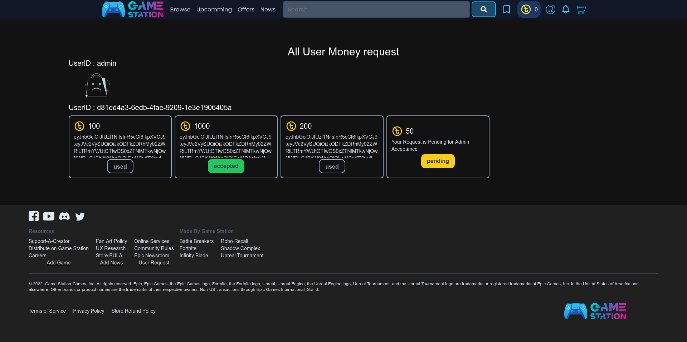

# Game-Station

Clone of  Epic Game Store

#### almost complete project , still many things to upgrade

- Front-end :  Svelte, Sveltekit, Tailwindcss, Typescript 

- Backend : Golang , Gin framework

- Container: Docker , Docker Compose 

- Object Storage : MinIO 

- Database : MongoDB , PostgresQL

[http://localhost:5173/](http://localhost:5173/)

## Game Profile

## Buy Each Game

http://loalhost:5173/[gameid]

## News

## Add Game (for admin)

## Add News News (for Admin)

## User Money Request (for Admin)

## Browse all Game and Search

http://localhost:5173/browse

## Upcomming Games

http://localhost:5173/upcomming

## Offer games

http://localhost:5173/offer

## contract admin

## contract developer

## Request token

 

## Wish list

## notification

## Reset Password

## Transactions

## Empty Cart

## Payment Management

## Upcomming

## Cart List

## Login

    

## profile

## UserProfile

